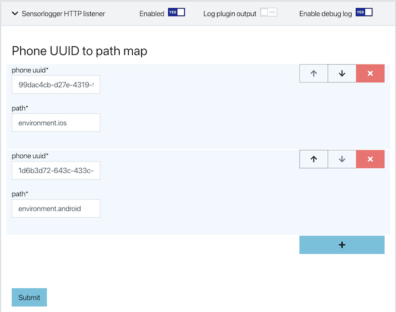

# sk-sensorlogger-plugin

This SignalK plugin defines a HTTP endpoint for
[free sensorlogger mobile app for iOS and Android](https://www.tszheichoi.com/sensorlogger) 
to push selected sensor readings into the [SignalK server](https://github.com/SignalK/signalk-server).

Example iOS sensorlogger setup:

Result in SignalK:

This code is a rough first cut and currently provided no means for authentication and bypasses 
the SignalK authentication mechanism.

# Configuration:

By default, the samples by any sensorlogger client will be recorded under `environment.sensorlogger.<sensor>.key`.
However, each push message conveys the phone's UUID. These UUID's can be used to route sensor samples by different phones to different SignalK paths.

To do so:
- find out the UUIDs of the phones involved
- in the sk-sensorlogger plugin config tab, enter a map entry for each UUID and the SignalK path fragment.

To figure out the UUID of your phone(s), turn on debugging via `Enable debug log` and start recording in sensorlogger with HTTP push enabled - the UUID's should appear in the server log:

`   sk-sensorlogger device uuid:  ad7e4997-ac64-4072-94f4-ebfbf84118ca +138ms`

# Other references to Sensorlogger:

https://github.com/tszheichoi/awesome-sensor-logger/
