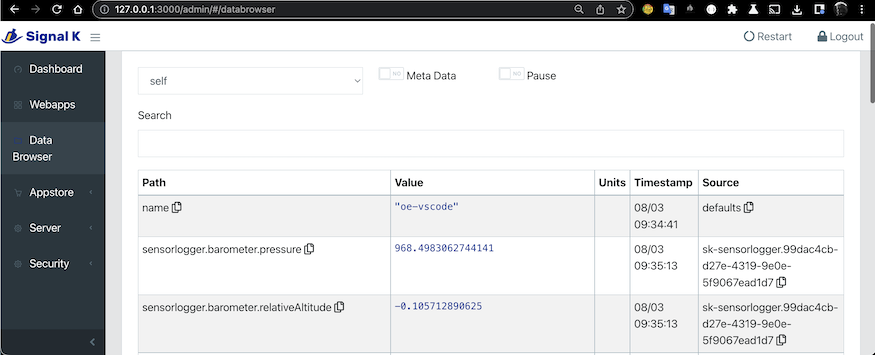

# sk-sensorlogger-plugin

This SignalK plugin defines a HTTP endpoint for
[free sensorlogger mobile app for iOS and Android](https://www.tszheichoi.com/sensorlogger) 
to push selected sensor readings into the [SignalK server)[https://github.com/SignalK/signalk-server].

Example iOS sensorlogger setup:

Result in SignalK:

This code is a rough first cut and currently provided no means for authentication and bypasses 
the SignalK authentication mechanism.

see also:

https://github.com/tszheichoi/awesome-sensor-logger/
